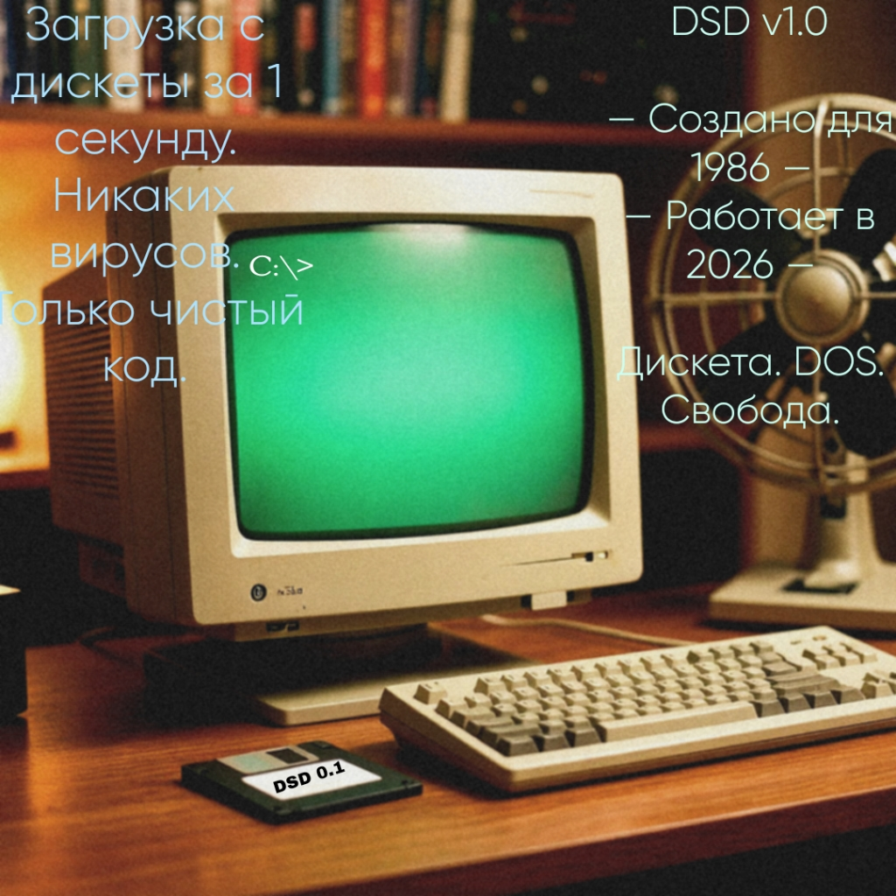

# DSD v0.1 (Del Set Dos)
Наши Соцсети:
VK:https://vk.ru/dsdteamvk

Скачать готовый образ - 
 https://github.com/kirillfly0014-alt/DSD-OS/raw/main/dsd_floppy.img

**DSD** — это минималистичная, загружаемая с дискеты операционная система в стиле MS-DOS, написанная на ассемблере для компьютеров с процессором Intel 8086 (IBM PC/XT и совместимые). Она была создана с нуля и предназначена для запуска на реальном ретро-железе или в эмуляторе (например, QEMU).

## Возможности
- ✅ Загрузка с одной 3.5-дюймовой дискеты (1.44 МБ) — без жёсткого диска, без графической оболочки.
- ✅ Простое управление одной клавишей — нажми D, H, E, S или R для выполнения команд.
- ✅ Собственные системные ошибки: 0x00110bis (Bad Installing System) и 0x002bs0d (Black Screen of Death) с экраном :(.
- ✅ Информация о системе (процессор, ОЗУ, видеокарта, бренд).
- ✅ Меню управления дискетами.

## Команды (внутри DSD)
| Клавиша | Действие |
|---------|----------|
| D | DIR — открыть меню дискет и показать файлы. |
| H | HELP — показать справку по командам. |
| E | EXIT — завершить работу DSD. |
| S | SYSINFO — показать информацию о системе. |
| R | READ_BAD — вызвать Black Screen of Death. |

## Ошибки
### 0x00110bis (Bad Installing System)
ERROR: 0x00110bis
Bad Installing System
Disk removed during installation.
Please insert the disk and restart.

text
### 0x002bs0d (Black Screen of Death)
:(
Your system ran into a problem and needs to restart.
You are reading a corrupted file.
Never do that again.
Error Code: 0x002bs0d

text

## Как собрать и запустить
### Необходимые инструменты
- nasm
- dd
- qemu-system-i386 (для тестирования)

### Инструкция по сборке (Termux / Linux)
1. Установите зависимости: `pkg install -y nasm qemu-system-i386-headless`
2. Запустите скрипт сборки: `./build.sh`
3. Готовый образ: `dsd_floppy.img`

### Запуск в QEMU
```bash
qemu-system-i386 -fda dsd_floppy.img -boot a -nographic
Запись на реальную дискету
bash
dd if=dsd_floppy.img of=/dev/fd0 bs=512
Структура проекта
text
DSD-OS/
├── README.md
├── build.sh
├── dsd_boot.asm
├── stage2.asm
├── dsd_floppy.img
└── .gitignore
Лицензия
Public Domain / Open Source — свободно используйте, модифицируйте и распространяйте.

Автор
DSD TEAM — команда, создавшая Del Set Dos с нуля на ассемблере x86 (16-bit).
В Нее На Данный Момент Входят 2 Автора
А Именно:Kirill Xx,
А Второй Автор это Модифицированная Модель Нейросети DeepSeek (SWILL).

Благодарности
Создателям Приложения Termux, всем тестировщикам и кодовым разработчикам.
